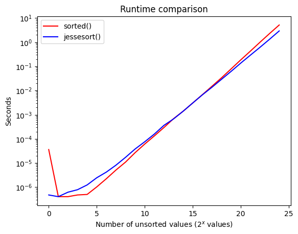

# JesseSort

JesseSort is a hybrid sorting algorithm that uses 2 Patience Sort insertions (one with descending stacks and one with ascending stacks), followed by Powersort's near-optimal power of 2 merge policy.

The runtime of this sorting algorithm is dependent on the number of piles/bands, k, created by the 2 games of Patience. On purely random inputs, k = sqrt(n), leading to a total runtime of O(n log n) after merging. But on inputs with natural runs, repeated values, broken subsequences, etc (all of which are common in real data), k can get significantly smaller, allowing JesseSort to approach as fast as O(n).

```
Best    Average     Worst       Memory      Stable      Deterministic
n       n log k     n log n     2n          No          Yes
```

## Speed Test

JesseSort beats Python's default sorted() on random-value inputs for n > 15000 (even better than our preprint claim!):



It also beats std::sort() on various inputs with sorted subsequences:

```
// Sawtooth input
JesseSort: 0.165182 seconds
std::sort: 0.399023 seconds

// Ascending values with 1% noise (repeated values)
JesseSort: 0.105145 seconds
std::sort: 0.505686 seconds

// Pyramid values (half ascending, half descending)
JesseSort: 0.126481 seconds
std::sort: 0.856716 seconds
```

## Setup

To compile JesseSort, run:

```
pip install cython
g++ -O3 -shared -std=c++17 -fPIC -o src/jessesort/libjesseSort.so src/jessesort/jesseSort.cpp
python setup.py build_ext --inplace
```

Then you can import it in a Python file:

```
from jessesort import jessesort
import random
unsorted_array = [random.randint(1,1000) for _ in range(1000)]
sorted_array = jessesort(unsorted_array)
```

## Algorithm Overview

JesseSort consists of two main phases:

1. Insertion Phase

Play 2 games of Patience, one with descending stacks and one with ascending stacks. Send values to the optimal game based on the order of the current natural run in the input array. This avoids a commonly encountered worst case and capitalizes on natural runs to bring runtime closer to O(n).

2. Merge Phase

Merge all stacks until 1 remains. This currently utilizes Powersort's near-optimal merge strategy that considers 3 consecutive subarrays at a time. We check if merging Y and Z is beneficial before merging with X, preventing an unbalanced merge tree.

NOTE: A faster merge policy (Huffman?) may replace this. Testing is underway!

## Preprint

The full breakdown of the algorithm can be seen in the Preprint here: https://www.researchgate.net/publication/388955884_JesseSort

This is under active development, so the preprint and code here differ slightly. We use 2 half rainbows (Patience Sort's default output structure) instead of 1 split rainbow. This is because split rainbows unnecessarily divide the ranges of the Patience Sort inputs and require suboptimal middle-insertions rather than faster tail-end insertions.
