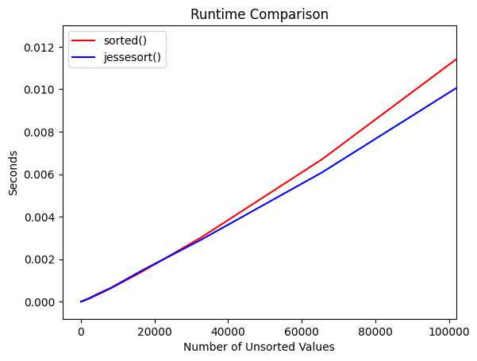

# JesseSort

JesseSort is a sorting algorithm that uses 2 Patience Sort insertions (one with descending stacks and one with ascending stacks), followed by a merge phase.

The runtime of this sorting algorithm is dependent on the number of piles/bands, k, created by the 2 games of Patience. On purely random inputs, k = sqrt(n), leading to a total runtime of O(n log n) after merging. But on inputs with natural runs, repeated values, broken subsequences, etc (all of which are common in real data), k can get significantly smaller, allowing JesseSort to approach as fast as O(n).

```
Best    Average     Worst       Memory      Stable      Deterministic
n       n log k     n log n     2n          No          Yes
```

## Speed Test

JesseSort beats std::sort() on various inputs with sorted subsequences. Values below are median (not mean) ratios of JesseSort / std::sort. A value of 0.5 means JesseSort takes half as much time (2x faster), while a value of 2.0 means JesseSort takes twice as much time (2x slower). 100 trials were run for each cell below and averaged.

With a AMD Ryzen 7 7445HS CPU:

```
                      Number of Input Values
Input Type            1000          10000         100000        1000000
------------------------------------------------------------------------------
Random                0.984         1.032         1.042         1.088
Sorted                1.022         0.679         0.583         1.448?
Reverse               1.636         1.076         0.900         2.101?
Sorted+Noise(5%)      1.048         1.041         1.079         1.201
Random+Repeats(50%)   1.037         1.032         1.031         1.089
Jitter                1.012         0.674         0.586         1.443?
Alternating           0.829         1.011         0.974         1.018
Sawtooth              1.121         0.960         0.978         1.072
BlockSorted           1.046         0.950         0.928         1.153
OrganPipe             0.446         0.232         0.138         0.268
Rotated               0.596         0.522         0.396         0.716
Signal                1.402         0.828         0.659         0.582
```

With an Intel Core i9 13900K CPU:
Note: These ratios are using outdated code. Keeping them to demonstrate how the new input adaptive logic greatly sped up the Random input case but at the cost of faster structured inputs.

```
                      Number of Input Values
Input Type            1000          10000         100000        1000000       10000000
--------------------------------------------------------------------------------------------
Random                1.587         1.477         1.433         1.484         1.596
...
Alternating           2.809         1.066         0.748         0.796         1.062
Sawtooth              1.576         0.439         0.361         0.372         0.376
BlockSorted           0.830         0.355         0.250         0.276         0.285
OrganPipe             0.288         0.164         0.112         0.107         0.106
Rotated               0.498         0.455         0.350         0.277         0.378
```

JesseSort also beats Python's default sorted() on random-value inputs for n > 20000 (>10x faster than our preprint claim):



## Setup

To compile and test JesseSort, run:

```
cd src/jessesort
g++ -O3 -march=native -DNDEBUG -std=c++23 main.cpp jesseSort.cpp -lfftw3 -lfftw3_threads -lm -o jesseSortTest
./jesseSortTest
```

For use in Python, run:

```
pip install cython
g++ -O3 -shared -std=c++17 -fPIC -o src/jessesort/libjesseSort.so src/jessesort/jesseSort.cpp
python setup.py build_ext --inplace
```

Then you can import it in a Python file:

```
from jessesort import jessesort
import random
unsorted_array = [random.randint(1,1000) for _ in range(1000)]
sorted_array = jessesort(unsorted_array)
```

## Algorithm Overview

JesseSort consists of two main phases:

1. Insertion Phase

Play 2 games of Patience, one with descending stacks and one with ascending stacks. Send values to the optimal game based on the order of the current natural run in the input array. This avoids a commonly encountered worst case and capitalizes on natural runs to bring runtime closer to O(n).

2. Merge Phase

Merge all stacks until 1 remains. This currently utilizes either a Timsort-inspired "best 2 out of 3" policy or the basic "increasing powers of 2" merge strategy (see the comments in the code). Testing is underway, so a faster merge policy (Huffman?) may replace this.

## Preprint

A breakdown of the original algorithm can be seen in the Preprint here: https://www.researchgate.net/publication/388955884_JesseSort

This is under active development, so the preprint and code here differ. At the time of writing, I had not heard of Patience Sort--a lot has changed since then. We now use 2 half rainbows (Patience Sort's default output structure) instead of 1 split rainbow. This is because split rainbows unnecessarily divide the ranges of the Patience Sort inputs and require suboptimal middle-insertions rather than faster tail-end insertions.

## Final Thoughts

My PhD has pulled me away from this project for a bit. I've actually come up with a couple other sorting algorithms that will have to wait as well! I will continue to update this in my free time whenever possible, but progress will be slower than before. Finally, I want to thank you all for your support and feedback--a special thank you to Sebastian Wild, Kenan Millet, and my beloved wife. Sorting is not my area of expertise, so I appreciate all your *patience*. 😉
